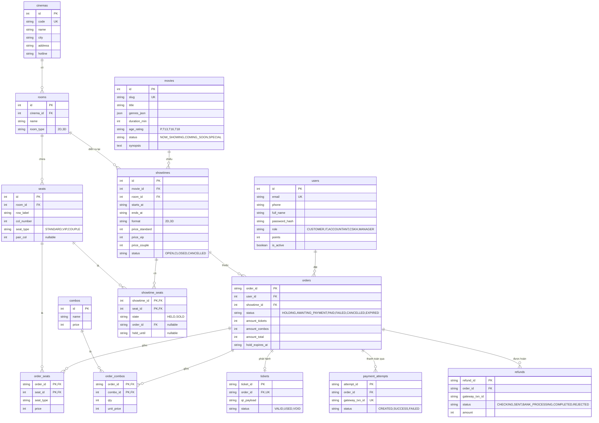
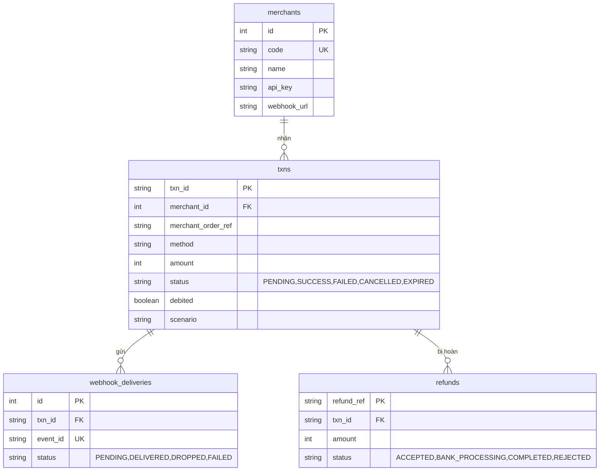

# Sơ đồ Thực thể - Mối quan hệ (ERD)

## 1. Beta API Database (`beta.sqlite`)

```mermaid
erDiagram
    users {
        int id PK
        string email UK
        string phone
        string full_name
        string password_hash
        string role "CUSTOMER,IT,ACCOUNTANT,CSKH,MANAGER"
        int points
        boolean is_active
    }

    cinemas {
        int id PK
        string code UK
        string name
        string city
        string address
        string hotline
    }

    rooms {
        int id PK
        int cinema_id FK
        string name
        string room_type "2D,3D"
    }

    seats {
        int id PK
        int room_id FK
        string row_label
        int col_number
        string seat_type "STANDARD,VIP,COUPLE"
        int pair_col "nullable"
    }

    movies {
        int id PK
        string slug UK
        string title
        json genres_json
        int duration_min
        string age_rating "P,T13,T16,T18"
        string status "NOW_SHOWING,COMING_SOON,SPECIAL"
        text synopsis
    }

    showtimes {
        int id PK
        int movie_id FK
        int room_id FK
        string starts_at
        string ends_at
        string format "2D,3D"
        int price_standard
        int price_vip
        int price_couple
        string status "OPEN,CLOSED,CANCELLED"
    }

    combos {
        int id PK
        string name
        int price
    }

    orders {
        string order_id PK
        int user_id FK
        int showtime_id FK
        string status "HOLDING,AWAITING_PAYMENT,PAID,FAILED,CANCELLED,EXPIRED"
        int amount_tickets
        int amount_combos
        int amount_total
        string hold_expires_at
    }

    order_seats {
        string order_id PK,FK
        int seat_id PK,FK
        string seat_type
        int price
    }

    order_combos {
        string order_id PK,FK
        int combo_id PK,FK
        int qty
        int unit_price
    }

    showtime_seats {
        int showtime_id PK,FK
        int seat_id PK,FK
        string state "HELD,SOLD"
        string order_id FK "nullable"
        string held_until "nullable"
    }

    tickets {
        string ticket_id PK
        string order_id FK,UK
        string qr_payload
        string status "VALID,USED,VOID"
    }

    payment_attempts {
        string attempt_id PK
        string order_id FK
        string gateway_txn_id UK
        string status "CREATED,SUCCESS,FAILED"
    }

    refunds {
        string refund_id PK
        string order_id FK
        string gateway_txn_id
        string status "CHECKING,SENT,BANK_PROCESSING,COMPLETED,REJECTED"
        int amount
    }

    cinemas ||--o{ rooms : "có"
    rooms ||--o{ seats : "chứa"
    movies ||--o{ showtimes : "chiếu"
    rooms ||--o{ showtimes : "diễn ra tại"
    users ||--o{ orders : "đặt"
    showtimes ||--o{ orders : "thuộc"
    orders ||--o{ order_seats : "gồm"
    seats ||--o{ order_seats : "là"
    orders ||--o{ order_combos : "gồm"
    combos ||--o{ order_combos : "là"
    showtimes ||--o{ showtime_seats : "có"
    seats ||--o{ showtime_seats : "là"
    orders ||--o| tickets : "phát hành"
    orders ||--o{ payment_attempts : "thanh toán qua"
    orders ||--o{ refunds : "được hoàn"
```

## 2. Gateway Database (`gateway.sqlite`)

```mermaid
erDiagram
    merchants {
        int id PK
        string code UK
        string name
        string api_key
        string webhook_url
    }

    txns {
        string txn_id PK
        int merchant_id FK
        string merchant_order_ref
        string method
        int amount
        string status "PENDING,SUCCESS,FAILED,CANCELLED,EXPIRED"
        boolean debited
        string scenario
    }

    webhook_deliveries {
        int id PK
        string txn_id FK
        string event_id UK
        string status "PENDING,DELIVERED,DROPPED,FAILED"
    }

    refunds {
        string refund_ref PK
        string txn_id FK
        int amount
        string status "ACCEPTED,BANK_PROCESSING,COMPLETED,REJECTED"
    }

    merchants ||--o{ txns : "nhận"
    txns ||--o{ webhook_deliveries : "gửi"
    txns ||--o{ refunds : "bị hoàn"
```
